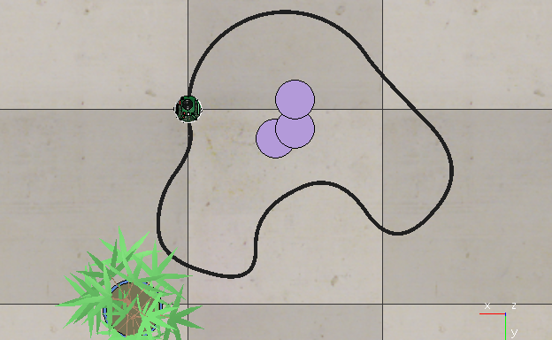
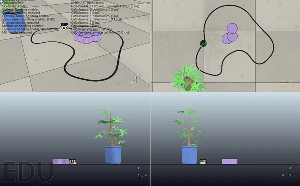

[RoboComp.VREP Components](http://robocomp.org)
===============================

[](https://gitter.im/robocomp/V-REP?utm_source=badge&utm_medium=badge&utm_campaign=pr-badge&utm_content=badge)

by [RoboLab](http://robolab.unex.es), [Aston University](https://www2.aston.ac.uk/eas), [ISIS](http://www.grupoisis.uma.es/index.php?option=com_jresearch&view=staff&Itemid=3&lang=es) and many other collaborators.

RoboComp is an open-source Robotics framework providing the tools to create and modify software components that communicate through public interfaces. RoboComp’s existing simulator, RCIS, is based on OpenSceneGraph technology and custom made actuators and sensor. This repository contains the prototypes of robotics simulation using V-REP that use V-REP's API to connect them to RoboComp ecosystem. Specifically, this repo consists of RoboComp components that uses V-REP as an external simulator.

> **If you don't have RoboComp installed on your system, find the installation instructions [here](https://github.com/robocomp/robocomp).**


# V-REP installation

To install V-REP, please follow the following instructions:

1. Download a version of EDUCATIONAL V-REP from [here](http://www.coppeliarobotics.com/downloads.html), according to your system specification. 
2. Unpack the compressed file to somewhere in your system. 
3. Go to the V-REP folder and run the command:
```
sudo ./vrep.sh
```

The above command will start the V-REP simulation software.
If you are not familiar with V-REP, follow our short [tutorial](https://github.com/robocomp/V-REP/blob/master/doc/V-REP_API.md) that cover general operational principles of the V-REP simulator or you can go through this awesome [tutorials](https://www.youtube.com/playlist?list=PL38P7Q24q4XA7c0uNj0kO4or-bKhFYdIg) on YouTube that covers the same.


# Testing RoboComp.VREP Components

From here on, we assume you are familiar with RoboComp and the working of components. If not, please follow these [tutorials](https://github.com/robocomp/robocomp/blob/stable/doc/README.md).

Next, we will introduce how one can test the [linefollowingVREP](https://github.com/robocomp/V-REP/tree/master/components/linefollowingVREP) component.

> **Note:**  Before moving further, make sure you have RoboComp and V-REP installed on your system.

# linefollowingVREP Component

### Description

This component communicates with cameraVREP component to get images of the floor (floor is in the scene simulated on V-REP). And, using that image it determines the directions to move so as to follow the path on the floor.
The below image shows the V-REP scene with the black-colored path drawn on the floor:



The linefollowingVREP component communicates with cameraVREP component to get the image of the floor, which looks like:


Using the image (which looks like above image), linefollwingVREP component determines which direction to move, for example:
- if the black patch is in the center of image (as in the above image), implies robot has to move straight.
- if the black patch is in the right of image, implies robot has to turn right.
- if the black patch is in the left of image, implies robot has to turn left.

To turn to the determined direction, linefollowingVREP component communicates with differentialrobotVREP component.

## Testing the Component

For testing, copy the folders [*cameraVREP*](./components/cameraVREP), [*differentialrobotVREP*](./components/differentialrobotVREP), [*linefollowingVREP*](./components/linefollowingVREP) inside _robocomp/components/_.

And, the scene file for testing the component can be found [here](./components/hexapod/lineFollowerDemo.ttt).

#### Edit Configuration file

Now, to enable the linefollowingVREP component to communicate, we need to tell the linefollowingVREP component where to find the differentialrobotVREP and the cameraVREP interfaces. 

> **Note:** In the current scenario, linefollowingVREP component is a client that communicates with differentialrobotVREP and cameraVREP components.

> **You can find the port on which cameraVREP and differentialrobotVREP are hosted in _etc/config_ file inside the respective components directory.**


So, now we need to change the ports in the configuration file of linefollowingVREP components accordingly.

```
# go inside the component
cd V-REP/components/linefollowingVREP

# open the config file of the component in any editor. For example,
vim etc/config

```

Now, change the port numbers on which cameraVREP and differentialrobotVREP accordingly i.e change the port numbers in the following lines:

```python
DifferentialRobotProxy = differentialrobot:tcp -h localhost -p 10177
CameraSimpleProxy = camerasimple:tcp -h localhost -p 10178
```


> **Note: The current config files are already well setted up, so you can test the components directly**.


#### Running the component

```
cd robocomp/components/
```
Open 4 new terminals.

Terminal 1: 
```
1. Open the scene lineFollowerDemo.ttt in V-REP.
2. Now, start the scene. That will start the server with two socket at 19999, 19997.
```

Terminal 2:
```
cd differentialrobotVREP
python src/differentialrobotVREP.py --Ice.Config=etc/config
```

Terminal 3: 
```
cd cameraVREP
python src/cameraVREP.py --Ice.Config=etc/config
```

Terminal 4: 
```
cd linefollowingVREP
python src/linefollowingVREP.py --Ice.Config=etc/config
```


Now, switch to the V-REP simulator and see the robot following the path on the floor. Here, is the demo of the same:





---------------------------------------------------------------------
You can find more tutorials on RoboComp.VREP in [tutorials](doc/README.md) 

Drop comments and ask questions in:

- https://groups.google.com/forum/?hl=en#!forum/robocomp-dev
- https://gitter.im/robocomp

Please, report any bugs to pbustos@unex.es

If you have any suggestions to improve the repository, like features or tutorials, please contact: robocomp.team@gmail.com 

